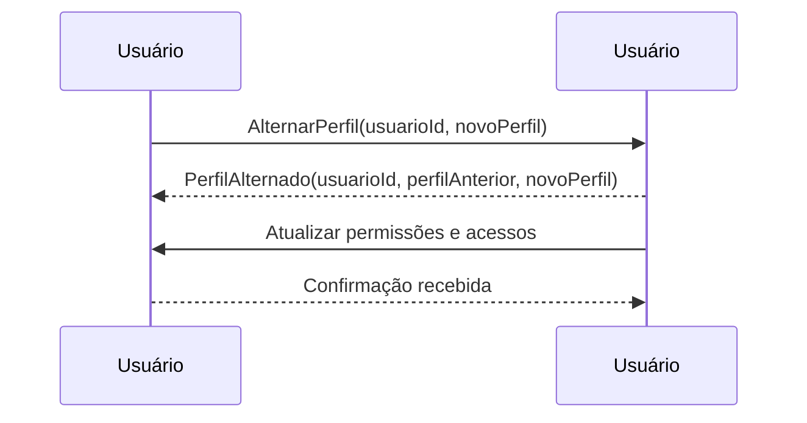

# Event Storming: Jornada do Comprador - Alternar entre Perfis de Comprador e Vendedor

## 📌 Contexto
Este documento descreve o **Event Storming** para o processo de alternância entre perfis de comprador e vendedor dentro da plataforma. Ações organizadas dentro de seus respectivos **Bounded Contexts**.

---

## 🔵 Comandos (Commands)
Os comandos representam ações explícitas no sistema, iniciadas pelo usuário ou processos automatizados.

### **Contexto de Usuário**
- `AlternarPerfil(usuarioId, novoPerfil)`: Alterna o perfil do usuário entre **Comprador** e **Vendedor**.

---

## 🟠 Eventos do Domínio (Domain Events)
Os eventos são gerados como resultado da execução de comandos bem-sucedidos.

### **Contexto de Usuário**
- `PerfilAlternado(usuarioId, perfilAnterior, novoPerfil)`: Indica que o perfil do usuário foi alterado.

---

## 🟡 Agregados e Entidades
Os agregados e entidades representam os principais modelos de dados envolvidos.

### **Contexto de Usuário**
#### **Usuário**
- **ID**: Identificador único do usuário.
- **Nome**: Nome do usuário.
- **Perfil Ativo**: Pode ser `Comprador` ou `Vendedor`.

---

## 🟣 Políticas (Regras de Negócio / Process Managers)
As regras de negócio definem as condições e fluxos obrigatórios dentro do sistema.

1. O usuário pode alternar entre os perfis **Comprador** e **Vendedor** a qualquer momento.
2. Certas permissões e acessos são redefinidos ao alternar o perfil.
3. O histórico de compras e vendas permanece associado ao usuário independentemente do perfil ativo.

---

## 🟢 Leitura (Projeções / Queries)
Consultas utilizadas para recuperar informações relevantes sobre o perfil do usuário.

- `ObterPerfilAtual(usuarioId)`: Retorna o perfil atualmente ativo do usuário.
- `ObterHistoricoPerfis(usuarioId)`: Retorna um histórico de alterações de perfil do usuário.

---

## ⚡ Fluxo Completo

1️⃣ **O usuário acessa a opção de alternância de perfil.**  
   - ➡️ **Comando:** `AlternarPerfil(usuarioId, novoPerfil)`  
   - 🚀 **Evento:** `PerfilAlternado(usuarioId, perfilAnterior, novoPerfil)`

2️⃣ **O sistema atualiza o perfil ativo do usuário.**  
   - 🚀 **Evento:** `PerfilAlternado(usuarioId, perfilAnterior, novoPerfil)`

3️⃣ **O usuário recebe a confirmação da alternância de perfil.**

4️⃣ **Os acessos e permissões são ajustados conforme o novo perfil.**

---

## 🔷 Diagrama

---

Este **Event Storming** documenta os comandos, eventos, agregados e regras de negócio relacionados à alternância entre perfis de comprador e vendedor, deixando explícita a separação dos **Bounded Contexts** envolvidos.

