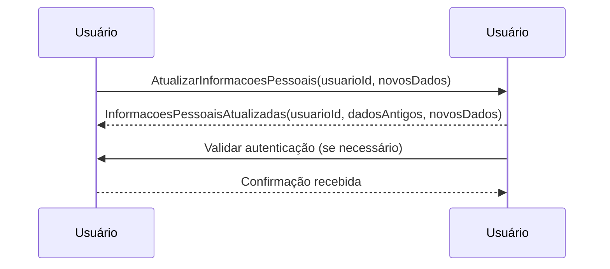

# Event Storming: Jornada do Comprador - Atualizar Informações Pessoais

## 📌 Contexto
Este documento descreve o **Event Storming** para o processo de atualização de informações pessoais do usuário dentro da plataforma. Ações organizadas dentro de seus respectivos **Bounded Contexts**.

---

## 🔵 Comandos (Commands)
Os comandos representam ações explícitas no sistema, iniciadas pelo usuário ou processos automatizados.

### **Contexto de Usuário**
- `AtualizarInformacoesPessoais(usuarioId, novosDados)`: Atualiza as informações pessoais do usuário, como nome, e-mail e telefone.

---

## 🟠 Eventos do Domínio (Domain Events)
Os eventos são gerados como resultado da execução de comandos bem-sucedidos.

### **Contexto de Usuário**
- `InformacoesPessoaisAtualizadas(usuarioId, dadosAntigos, novosDados)`: Indica que os dados pessoais do usuário foram atualizados com sucesso.

---

## 🟡 Agregados e Entidades
Os agregados e entidades representam os principais modelos de dados envolvidos.

### **Contexto de Usuário**
#### **Usuário**
- **ID**: Identificador único do usuário.
- **Nome**: Nome do usuário.
- **E-mail**: Endereço de e-mail cadastrado.
- **Telefone**: Número de telefone vinculado à conta.

---

## 🟣 Políticas (Regras de Negócio / Process Managers)
As regras de negócio definem as condições e fluxos obrigatórios dentro do sistema.

1. O usuário pode atualizar suas informações pessoais a qualquer momento.
2. Certas informações, como e-mail, podem exigir confirmação para serem alteradas.
3. Alterações sensíveis podem exigir autenticação adicional (MFA).
4. O sistema mantém um histórico das alterações para auditoria.

---

## 🟢 Leitura (Projeções / Queries)
Consultas utilizadas para recuperar informações relevantes sobre os dados do usuário.

- `ObterInformacoesPessoais(usuarioId)`: Retorna as informações pessoais atuais do usuário.
- `ObterHistoricoAlteracoes(usuarioId)`: Retorna o histórico de mudanças nas informações pessoais do usuário.

---

## ⚡ Fluxo Completo

1️⃣ **O usuário acessa a opção de atualização de informações pessoais.**  
   - ➡️ **Comando:** `AtualizarInformacoesPessoais(usuarioId, novosDados)`  
   - 🚀 **Evento:** `InformacoesPessoaisAtualizadas(usuarioId, dadosAntigos, novosDados)`

2️⃣ **O sistema valida e processa a atualização dos dados.**  
   - 🚀 **Evento:** `InformacoesPessoaisAtualizadas(usuarioId, dadosAntigos, novosDados)`

3️⃣ **O usuário recebe a confirmação da atualização.**

4️⃣ **Se necessário, o sistema solicita autenticação adicional para alterações sensíveis.**

---

## 🔷 Diagrama

---

Este **Event Storming** documenta os comandos, eventos, agregados e regras de negócio relacionados à atualização de informações pessoais do usuário, deixando explícita a separação dos **Bounded Contexts** envolvidos.

