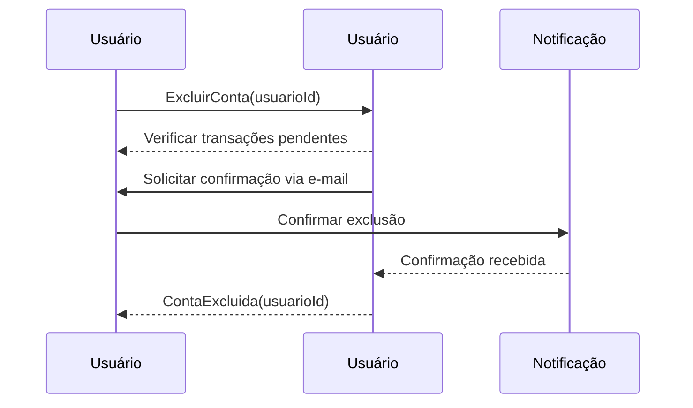

# Event Storming: Jornada do Comprador - Excluir Conta Permanentemente

## 📌 Contexto
Este documento descreve o **Event Storming** para o processo de exclusão permanente da conta do usuário dentro da plataforma. Ações organizadas dentro de seus respectivos **Bounded Contexts**.

---

## 🔵 Comandos (Commands)
Os comandos representam ações explícitas no sistema, iniciadas pelo usuário ou processos automatizados.

### **Contexto de Usuário**
- `ExcluirConta(usuarioId)`: Solicita a exclusão permanente da conta do usuário.

---

## 🟠 Eventos do Domínio (Domain Events)
Os eventos são gerados como resultado da execução de comandos bem-sucedidos.

### **Contexto de Usuário**
- `ContaExcluida(usuarioId)`: Indica que a conta do usuário foi removida permanentemente.

---

## 🟡 Agregados e Entidades
Os agregados e entidades representam os principais modelos de dados envolvidos.

### **Contexto de Usuário**
#### **Usuário**
- **ID**: Identificador único do usuário.
- **Nome**: Nome do usuário.
- **E-mail**: Endereço de e-mail cadastrado.
- **Status**: Pode ser `Ativo`, `Pendente` ou `Excluído`.

---

## 🟣 Políticas (Regras de Negócio / Process Managers)
As regras de negócio definem as condições e fluxos obrigatórios dentro do sistema.

1. O usuário pode solicitar a exclusão da conta a qualquer momento.
2. A exclusão é irreversível e todos os dados do usuário são removidos.
3. O sistema deve garantir que o usuário não possua transações pendentes antes da exclusão.
4. Um e-mail de confirmação é enviado antes da remoção definitiva da conta.

---

## 🟢 Leitura (Projeções / Queries)
Consultas utilizadas para recuperar informações relevantes sobre a conta do usuário.

- `ObterStatusConta(usuarioId)`: Retorna o status atual da conta do usuário.
- `VerificarTransacoesPendentes(usuarioId)`: Retorna se o usuário possui transações pendentes antes da exclusão.

---

## ⚡ Fluxo Completo

1️⃣ **O usuário acessa a opção de exclusão de conta.**  
   - ➡️ **Comando:** `ExcluirConta(usuarioId)`  
   - 🚀 **Evento:** `ContaExcluida(usuarioId)`

2️⃣ **O sistema verifica se há transações pendentes.**  
   - 🚀 **Query:** `VerificarTransacoesPendentes(usuarioId)`

3️⃣ **Se não houver pendências, o sistema solicita confirmação via e-mail.**

4️⃣ **Após a confirmação, o sistema remove os dados do usuário e finaliza a exclusão.**

---

## 🔷 Diagrama

---

Este **Event Storming** documenta os comandos, eventos, agregados e regras de negócio relacionados à exclusão permanente da conta do usuário, deixando explícita a separação dos **Bounded Contexts** envolvidos.

