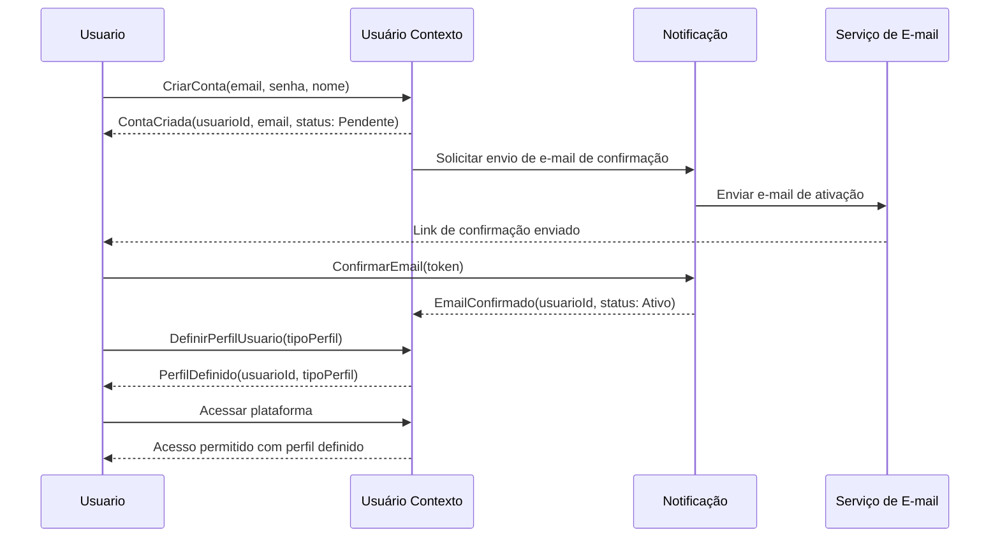
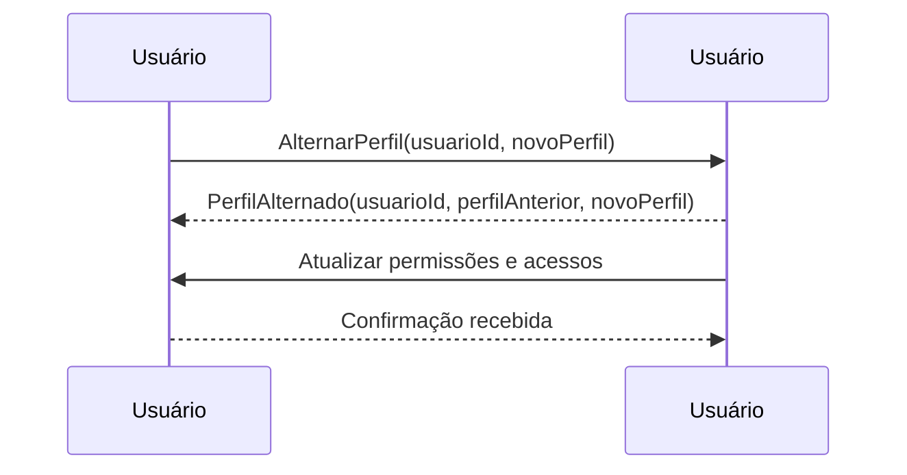
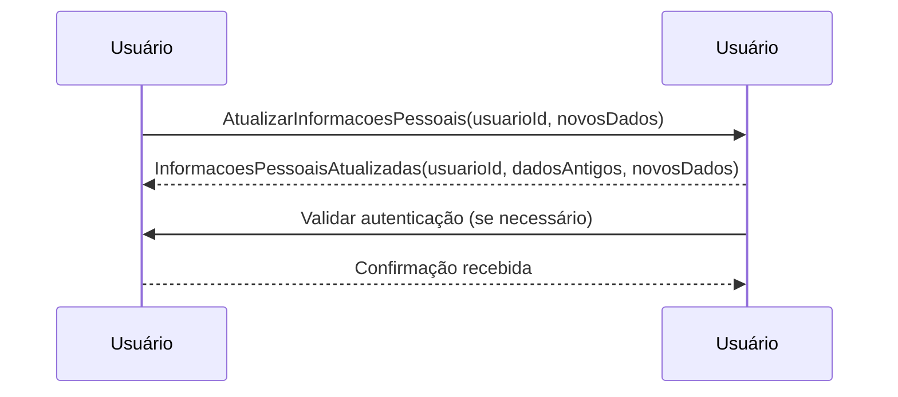
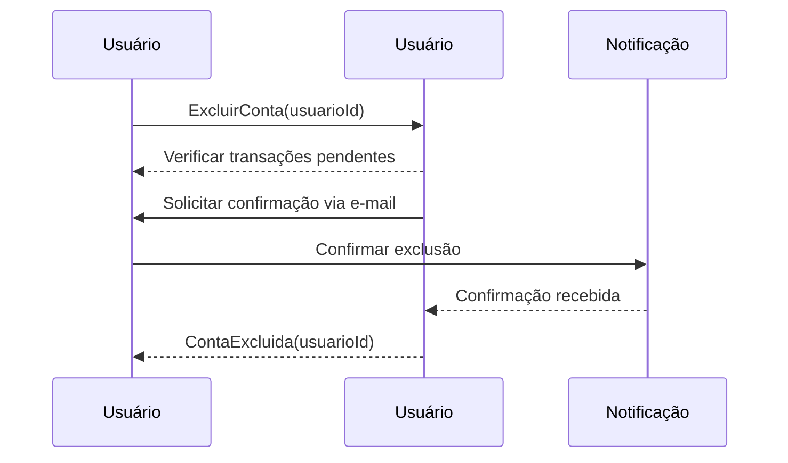

# Home

<meta http-equiv="refresh" content="0; url=visao-geral-da-documentacao/">

---

# 📌 Introdução

# Bem-vindo à Documentação do Bazarium

## Introdução
O **Bazarium** é um marketplace digital projetado para conectar compradores e vendedores de forma segura e eficiente. Esta documentação fornece informações detalhadas sobre o sistema, incluindo sua arquitetura, funcionalidades e requisitos técnicos.

## Objetivo
O **Bazarium** tem como propósito oferecer uma plataforma flexível e escalável para comércio eletrônico, garantindo a segurança das transações e proporcionando uma experiência fluida para todos os usuários.

## Como Navegar na Documentação
Esta documentação está organizada em seções para facilitar a compreensão e o uso do sistema:

### 📂 **Visão Geral**
- [Sobre o Projeto](sobre-o-projeto.md): Explicação detalhada sobre o propósito do **Bazarium**.
- [Objetivos](objetivos.md): Metas e benefícios esperados.
- [Público-Alvo](publico-alvo.md): Quem são os principais usuários da plataforma.

### 🛠 **Estrutura do Sistema**
- [Domínio](dominio.md): Conceitos principais e definições do sistema.
- [Bounded Contexts](bounded-contexts.md): Segmentação funcional do **Bazarium**.
- [Personas](personas.md): Perfis de usuários e seus comportamentos.
- [Jornadas](jornadas.md): Caminho percorrido pelos usuários dentro da plataforma.

### 🔍 **Funcionalidades e Requisitos**
- [Funcionalidades](funcionalidades.md): Lista detalhada dos recursos disponíveis.
- [Macro Jornadas](macro-jornadas.md): Fluxos principais de interação dos usuários.
- [Requisitos](requisitos.md): Requisitos funcionais e não funcionais do sistema.

### 📊 **Diagramas e Representações Visuais**
- Arquitetura do Sistema 
- Fluxo de Compra 
- Interações entre Usuários 

## Contribuição e Melhorias
Esta documentação é um trabalho em progresso. Se você encontrar informações desatualizadas ou desejar contribuir com melhorias, fique à vontade para sugerir alterações.

Explore a documentação e aproveite ao máximo o **Bazarium**!

---

# 🎯 Objetivos

# Objetivos do Bazarium

## Introdução
O **Bazarium** foi desenvolvido para oferecer uma solução eficiente e segura para a compra e venda de produtos online. Seu objetivo é criar um ambiente confiável onde compradores e vendedores possam interagir de forma intuitiva, garantindo segurança e escalabilidade em todas as transações.

## Objetivos Gerais
Os principais objetivos do **Bazarium** incluem:

- **Facilitar o comércio eletrônico**: Proporcionar uma plataforma intuitiva que simplifique o processo de compra e venda.
- **Garantir segurança nas transações**: Implementação de mecanismos avançados de autenticação e proteção contra fraudes.
- **Oferecer um ambiente flexível**: Permitir que diferentes tipos de vendedores gerenciem seus produtos de forma eficiente.
- **Fornecer múltiplas opções de pagamento**: Suporte para cartão de crédito, boleto, PIX e carteiras digitais.
- **Aprimorar a logística**: Integração com transportadoras para cálculo de frete e rastreamento de pedidos.
- **Personalizar a experiência do usuário**: Recomendações baseadas em comportamento de navegação e compras.
- **Garantir conformidade regulatória**: Adaptação às normas de proteção de dados (LGPD, GDPR).

## Objetivos Técnicos
Para garantir que o **Bazarium** atinja seus objetivos gerais, alguns princípios técnicos foram definidos:

- **Arquitetura escalável**: Suporte para um grande número de usuários simultâneos sem perda de desempenho.
- **Modularidade**: Organização do sistema em microserviços para facilitar a manutenção e expansão.
- **Baixa latência**: Otimização de tempo de resposta para garantir uma navegação fluida.
- **Integração via APIs**: Comunicação com serviços externos para pagamento, envio e notificações.
- **Segurança avançada**: Implementação de criptografia de dados e autenticação multifator.

## Impacto Esperado
O **Bazarium** visa transformar a forma como transações online são realizadas, proporcionando:

- **Maior acessibilidade**: Usuários podem vender e comprar com facilidade a partir de qualquer dispositivo.
- **Crescimento para vendedores**: Ampliação do alcance dos lojistas e empreendedores digitais.
- **Experiência otimizada para compradores**: Interface amigável e suporte a múltiplas formas de pagamento e envio.
- **Redução de riscos**: Menor incidência de fraudes e transações não autorizadas.

## Conclusão
O **Bazarium** é mais do que um marketplace – é uma solução projetada para evoluir constantemente e oferecer a melhor experiência para todos os seus usuários. Seus objetivos garantem um equilíbrio entre inovação, segurança e usabilidade, tornando-o uma referência no comércio eletrônico.

---

# 👥 Público-Alvo

# Público-Alvo do Bazarium

## Introdução
O **Bazarium** foi desenvolvido para atender diferentes perfis de usuários dentro do ecossistema de comércio eletrônico. A plataforma busca facilitar a interação entre compradores e vendedores, garantindo um ambiente seguro, intuitivo e eficiente para transações online.

## Perfis de Usuários
O **Bazarium** atende três principais categorias de usuários:

### 1️⃣ Compradores 🛒
Usuários que utilizam a plataforma para pesquisar, comparar e adquirir produtos.

🔹 **Características:**
- Buscam facilidade e segurança nas compras online.
- Valorizam recomendações personalizadas e avaliações de produtos.
- Precisam de suporte para rastreamento de pedidos e atendimento pós-venda.

🔹 **Principais necessidades:**
- Facilidade na busca e filtragem de produtos.
- Opções de pagamento seguras e variadas.
- Suporte eficiente para devoluções e reembolsos.
- Notificações sobre status de pedidos.

### 2️⃣ Vendedores 🏪
Empreendedores e empresas que cadastram produtos e utilizam a plataforma para comercialização.

🔹 **Características:**
- Precisam de ferramentas para gestão de catálogo e estoque.
- Buscam um canal de vendas eficiente e escalável.
- Valorizam relatórios e métricas para otimização de vendas.

🔹 **Principais necessidades:**
- Cadastro e gerenciamento eficiente de produtos.
- Processamento seguro de pagamentos.
- Definição personalizada de métodos de envio e logística.
- Comunicação direta com clientes para suporte e negociações.

### 3️⃣ Administradores do Marketplace 🛠️
Equipe responsável por garantir a segurança, desempenho e conformidade da plataforma.

🔹 **Características:**
- Gerenciam transações e monitoram possíveis fraudes.
- Avaliam métricas e relatórios para otimizar a experiência dos usuários.
- Implementam melhorias contínuas na plataforma.

🔹 **Principais necessidades:**
- Monitoramento de desempenho e estabilidade da plataforma.
- Gestão de segurança e conformidade regulatória (LGPD, GDPR).
- Moderação de conteúdo, avaliações e interações entre usuários.
- Controle sobre disputas e políticas de reembolso.

## Conclusão
O **Bazarium** é um marketplace projetado para atender compradores, vendedores e administradores, garantindo que cada perfil tenha acesso a recursos essenciais para uma experiência eficiente. A plataforma evolui constantemente para se adaptar às necessidades dos usuários e oferecer um ambiente confiável para o comércio digital.

---

# 📖 Sobre o Projeto

# Sobre o Projeto - Bazarium

## Introdução
O **Bazarium** é uma plataforma de marketplace digital que conecta compradores e vendedores, permitindo transações seguras e eficientes. O sistema foi projetado para suportar diferentes modelos de negócios, oferecendo uma estrutura flexível e escalável para o comércio eletrônico.

## Objetivos do Projeto
O **Bazarium** busca resolver desafios comuns em marketplaces, proporcionando uma solução centralizada para a gestão de vendas online. Seus principais objetivos incluem:

- **Facilitar a comercialização de produtos** entre vendedores e compradores.
- **Garantir segurança** nas transações, protegendo dados e pagamentos.
- **Oferecer uma experiência intuitiva** para usuários de diferentes perfis.
- **Integrar métodos de pagamento variados** e suportar múltiplas opções de frete.
- **Fornecer análise e relatórios detalhados** para ajudar vendedores a otimizar suas vendas.

## Estrutura do Sistema
O **Bazarium** é organizado em módulos distintos para garantir flexibilidade e manutenção eficiente:

- **Gerenciamento de Usuários**: Registro, autenticação e controle de permissões.
- **Catálogo de Produtos**: Cadastro, edição e organização de produtos.
- **Carrinho e Checkout**: Adição de produtos, cálculo de preços e finalização de compras.
- **Pagamentos e Segurança**: Processamento de pagamentos e proteção contra fraudes.
- **Logística e Entrega**: Integração com transportadoras, cálculo de frete e rastreamento de pedidos.
- **Sistema de Avaliação**: Registro de feedbacks e reputação de vendedores.
- **Notificações e Comunicação**: Alertas sobre status de pedidos e mensagens entre usuários.
- **Relatórios e Análises**: Monitoramento de métricas de vendas e comportamento dos usuários.

## Diferenciais do Bazarium
O **Bazarium** se diferencia de outras plataformas por meio de:
- **Arquitetura modular**, permitindo escalabilidade e customização.
- **Segurança robusta**, garantindo conformidade com normas como LGPD e GDPR.
- **Experiência do usuário otimizada**, com interfaces intuitivas e responsivas.
- **Automação de processos**, reduzindo a necessidade de gerenciamento manual.

## Público-Alvo
O **Bazarium** é projetado para atender diferentes tipos de usuários:
- **Compradores**: Indivíduos interessados em adquirir produtos online de maneira prática e segura.
- **Vendedores**: Empresas e empreendedores que desejam expandir suas vendas no meio digital.
- **Administradores**: Responsáveis pela gestão e segurança da plataforma.

## Conclusão
O **Bazarium** é uma solução completa para marketplaces, oferecendo um ambiente confiável e eficiente para transações comerciais. Sua arquitetura escalável, aliada a um conjunto robusto de funcionalidades, permite que compradores e vendedores interajam de forma segura e produtiva. Para mais informações sobre módulos específicos e funcionalidades detalhadas, consulte as demais seções da documentação.

---

# 🌎 Domínio

# Domínio do Bazarium

## Introdução
O **Bazarium** é um marketplace digital estruturado em domínios distintos para garantir modularidade, escalabilidade e manutenibilidade do sistema. Cada domínio representa um conjunto de funcionalidades coesas e bem definidas dentro do ecossistema da plataforma.

## Conceitos Principais
O sistema é segmentado em conceitos fundamentais que organizam sua lógica de negócio:

### 1️⃣ Usuário
Representa qualquer pessoa que interage com o sistema, seja como comprador, vendedor ou administrador.
- **Atributos principais**: ID, nome, e-mail, telefone, tipo de conta (comprador/vendedor/admin), data de cadastro.
- **Regras de negócio**:
  - Um usuário pode ter múltiplos endereços cadastrados.
  - A autenticação é obrigatória para acessar funcionalidades críticas.
  - Usuários podem alternar entre os papéis de comprador e vendedor.

### 2️⃣ Produto
Entidade que representa os itens disponíveis para compra na plataforma.
- **Atributos principais**: ID, nome, descrição, preço, estoque, categoria, imagens.
- **Regras de negócio**:
  - Apenas vendedores podem cadastrar e gerenciar produtos.
  - Cada produto pertence a uma única categoria.
  - O estoque deve ser atualizado após cada venda.

### 3️⃣ Pedido
Refere-se a uma transação iniciada por um comprador ao concluir uma compra.
- **Atributos principais**: ID, comprador, lista de produtos, valor total, status (pendente, pago, enviado, entregue, cancelado).
- **Regras de negócio**:
  - Um pedido só pode ser criado se todos os produtos estiverem disponíveis em estoque.
  - O status do pedido deve ser atualizado conforme o fluxo de processamento.
  - Pedidos podem ser cancelados antes da confirmação de envio.

### 4️⃣ Pagamento
Gerencia o processamento financeiro dentro do **Bazarium**.
- **Atributos principais**: ID da transação, pedido associado, método de pagamento, status da transação (autorizado, recusado, estornado).
- **Regras de negócio**:
  - Somente pedidos com pagamento autorizado são considerados válidos.
  - Pagamentos podem ser reembolsados conforme a política de cancelamento.
  - Integração com gateways de pagamento externos para processamento seguro.

### 5️⃣ Entrega
Controle do fluxo logístico dos pedidos realizados na plataforma.
- **Atributos principais**: ID do envio, pedido associado, código de rastreamento, transportadora, status de entrega (processando, enviado, entregue).
- **Regras de negócio**:
  - Apenas pedidos pagos podem gerar um envio.
  - O código de rastreamento deve ser gerado após a confirmação de envio.
  - O status deve ser atualizado conforme o andamento do transporte.

### 6️⃣ Avaliação
Módulo responsável pelo sistema de reputação dos produtos e vendedores.
- **Atributos principais**: ID, usuário avaliador, produto/vendedor, nota (1-5), comentário, data.
- **Regras de negócio**:
  - Somente compradores que concluíram uma compra podem avaliar um produto.
  - Vendedores podem responder avaliações para fornecer suporte.
  - Avaliações são públicas e influenciam a reputação do vendedor.

## Conclusão
O domínio do **Bazarium** é estruturado para garantir um fluxo eficiente de compra e venda dentro da plataforma. A segmentação em entidades bem definidas permite uma melhor organização do sistema, favorecendo a escalabilidade e a manutenção contínua.

---

# 👤 Personas

# Personas do Bazarium

## Introdução
O **Bazarium** atende a diferentes perfis de usuários, cada um com necessidades específicas dentro do ecossistema do marketplace. A definição das personas auxilia no desenvolvimento de funcionalidades otimizadas para cada tipo de usuário.

## Personas Principais
A seguir, são descritos os principais perfis de usuários do **Bazarium**:

### 1️⃣ **Comprador 🛒**
Usuário interessado em adquirir produtos na plataforma.

🔹 **Objetivos**:
- Encontrar e comprar produtos de forma rápida e segura.
- Comparar preços e avaliações antes da compra.
- Acompanhar pedidos e receber notificações de entrega.
- Solicitar reembolso ou devolução, se necessário.

🔹 **Principais necessidades**:
- Interface intuitiva para busca e filtros avançados.
- Métodos de pagamento variados e seguros.
- Rastreamento detalhado dos pedidos.
- Sistema de avaliação de vendedores e produtos.

### 2️⃣ **Vendedor 🏪**
Usuário que cadastra e gerencia produtos para venda na plataforma.

🔹 **Objetivos**:
- Cadastrar e gerenciar produtos com descrição, imagens e preços.
- Monitorar estoque e definir promoções.
- Processar pedidos e gerenciar envios.
- Receber avaliações e interagir com clientes.

🔹 **Principais necessidades**:
- Dashboard para monitoramento de vendas e métricas.
- Ferramentas para gestão de promoções e cupons.
- Opções de integração com sistemas de logística.
- Relatórios financeiros para acompanhamento de faturamento.

### 3️⃣ **Administrador do Marketplace 🛠️**
Usuário responsável por gerenciar a plataforma e garantir seu funcionamento adequado.

🔹 **Objetivos**:
- Supervisionar transações e operações na plataforma.
- Garantir conformidade com regulamentações e políticas da empresa.
- Monitorar e mitigar possíveis fraudes ou disputas.
- Gerenciar conteúdos e campanhas promocionais.

🔹 **Principais necessidades**:
- Painéis de monitoramento de transações e métricas de desempenho.
- Ferramentas para análise de segurança e detecção de fraudes.
- Interface para moderação de avaliações e interações entre usuários.
- Controle sobre campanhas de marketing e notificações para usuários.

### 4️⃣ **Gateway de Pagamento 💳 (Sistema Externo)**
Serviço responsável por processar pagamentos e transações financeiras.

🔹 **Objetivos**:
- Autorizar e processar pagamentos de forma segura.
- Emitir notas fiscais e gerenciar estornos.
- Garantir a conformidade das transações financeiras.

🔹 **Principais necessidades**:
- Integração com métodos de pagamento (cartão, boleto, PIX, etc.).
- Monitoramento antifraude e validação de identidade.
- Gestão de reembolsos e disputas de pagamento.

### 5️⃣ **Transportadora/Logística 🚚 (Sistema Externo ou Parceiro)**
Responsável por realizar a entrega dos pedidos aos compradores.

🔹 **Objetivos**:
- Definir custos e prazos de envio.
- Gerar código de rastreamento e atualizar status de entrega.
- Garantir a segurança e eficiência no transporte dos produtos.

🔹 **Principais necessidades**:
- Integração via API para atualização de status.
- Automação de cálculo de frete e tempo estimado de entrega.
- Registro de reclamações e suporte para problemas logísticos.

## Conclusão
A definição clara das personas no **Bazarium** permite um desenvolvimento mais focado nas necessidades específicas de cada usuário. Com essa segmentação, a plataforma pode otimizar a experiência e garantir um funcionamento eficiente para compradores, vendedores, administradores e parceiros logísticos.

---

# 📌 Bounded Contexts

# Bounded Contexts do Bazarium

## Introdução
O **Bazarium** é um marketplace digital que adota uma arquitetura baseada em **Bounded Contexts** para organizar e modularizar suas funcionalidades. Essa segmentação permite que diferentes partes do sistema operem de forma independente, facilitando a escalabilidade, manutenção e evolução da plataforma.

## Contextos Delimitados
A plataforma é segmentada em diferentes contextos funcionais, cada um com responsabilidades bem definidas:

### 1️⃣ **Contexto de Usuário**
Responsável pelo gerenciamento de identidade e acesso dos usuários.
- **Principais funcionalidades**:
  - Cadastro e autenticação.
  - Gerenciamento de perfis (comprador/vendedor/admin).
  - Segurança e autenticação multifator (MFA).

### 2️⃣ **Contexto de Catálogo**
Gerencia os produtos disponíveis no **Bazarium**.
- **Principais funcionalidades**:
  - Cadastro, edição e exclusão de produtos.
  - Organização em categorias e gerenciamento de estoque.
  - Regras de visibilidade e precificação dinâmica.

### 3️⃣ **Contexto de Venda**
Abrange todo o fluxo de compra até a geração do pedido.
- **Principais funcionalidades**:
  - Adição de produtos ao carrinho.
  - Processamento de checkout e cálculo de totais.
  - Criação e rastreamento de pedidos.

### 4️⃣ **Contexto de Pagamento**
Responsável pelo processamento financeiro das transações.
- **Principais funcionalidades**:
  - Integração com gateways de pagamento.
  - Processamento de autorizações e recusas.
  - Emissão de notas fiscais e controle de reembolsos.

### 5️⃣ **Contexto de Entrega**
Gerencia a logística e rastreamento dos pedidos.
- **Principais funcionalidades**:
  - Cálculo de frete e estimativa de prazos.
  - Geração de códigos de rastreamento.
  - Atualização automática do status de entrega.

### 6️⃣ **Contexto de Avaliação**
Controla o sistema de reputação dos produtos e vendedores.
- **Principais funcionalidades**:
  - Registro de avaliações e feedbacks.
  - Cálculo da reputação do vendedor.
  - Moderação de avaliações inadequadas.

### 7️⃣ **Contexto de Notificação**
Orquestra a comunicação entre a plataforma e os usuários.
- **Principais funcionalidades**:
  - Envio de notificações transacionais.
  - Comunicação entre compradores e vendedores.
  - Divulgação de promoções e alertas personalizados.

### 8️⃣ **Contexto de Relatórios**
Fornece insights e métricas operacionais para vendedores e administradores.
- **Principais funcionalidades**:
  - Geração de relatórios financeiros.
  - Monitoramento de desempenho de vendas.
  - Indicadores de experiência do usuário.

## Benefícios da Segmentação
A adoção de **Bounded Contexts** no **Bazarium** permite:
- **Modularidade**: Cada contexto pode evoluir independentemente.
- **Escalabilidade**: Possibilidade de distribuir serviços para melhor performance.
- **Manutenção facilitada**: Isolamento de responsabilidades reduzindo impacto de mudanças.
- **Maior segurança**: Controle granular sobre permissões e acesso aos dados.

## Conclusão
A segmentação do **Bazarium** em diferentes contextos delimitados permite uma arquitetura organizada e escalável, garantindo melhor desempenho e facilidade de manutenção. Essa abordagem facilita a evolução contínua da plataforma, garantindo que cada funcionalidade opere de forma independente e otimizada.

---

# 📋 Requisitos

# Requisitos do Bazarium

## Introdução
Os requisitos do **Bazarium** definem as funcionalidades e restrições técnicas que a plataforma deve atender para garantir sua operação eficiente e segura. Eles estão organizados em **requisitos funcionais** (RF) e **requisitos não funcionais** (RNF).

---

## 📌 **Requisitos Funcionais (RF)**
Os requisitos funcionais descrevem as funcionalidades essenciais da plataforma.

### 👤 **Perfis de Usuário**
- **RF01** - O sistema deverá permitir que cada usuário possua um perfil como Comprador ou Vendedor.
- **RF02** - O sistema deverá permitir que os usuários alternem entre os modos Comprador e Vendedor dentro de uma mesma conta.
- **RF03** - O sistema deverá permitir que os usuários adicionem foto de perfil e informações de contato, como telefone e endereço.
- **RF04** - O sistema deverá permitir que os usuários excluam suas contas permanentemente.

### 🔐 **Cadastro e Autenticação**
- **RF05** - O sistema deverá fornecer funcionalidades de cadastro e login para os usuários.
- **RF06** - O sistema deverá permitir que os usuários atualizem suas informações cadastrais.
- **RF07** - O sistema deverá oferecer a opção de login via redes sociais.
- **RF08** - O sistema deverá implementar autenticação multifator (MFA) para aumentar a segurança.

### 🏪 **Funcionalidades para Vendedores**
- **RF09** - O sistema deverá permitir que os vendedores cadastrem produtos no catálogo.
- **RF10** - O sistema deverá disponibilizar uma interface para que os vendedores possam acessar a lista de suas vendas.
- **RF11** - O sistema deverá permitir que os vendedores atualizem o status de suas vendas.
- **RF12** - O sistema deverá permitir que os vendedores criem promoções e cupons de desconto.

### 🛒 **Funcionalidades para Compradores**
- **RF13** - O sistema deverá permitir que os compradores adicionem produtos ao carrinho de compras.
- **RF14** - O sistema deverá permitir que os compradores finalizem a compra por meio de um checkout.
- **RF15** - O sistema deverá gerar um pedido no momento da finalização da compra.
- **RF16** - O sistema deverá permitir que os compradores solicitem reembolso ou devolução.

### ⭐ **Avaliações e Comentários**
- **RF17** - O sistema deverá permitir que os compradores avaliem os produtos após a compra.
- **RF18** - O sistema deverá permitir que os compradores publiquem comentários sobre os produtos adquiridos.
- **RF19** - O sistema deverá exibir as avaliações e comentários de compradores na página do produto.
- **RF20** - O sistema deverá calcular a média das notas recebidas por um vendedor.

### 📑 **Catálogo de Produtos e Pesquisa**
- **RF21** - O sistema deverá disponibilizar um catálogo de produtos.
- **RF22** - O sistema deverá permitir que os usuários filtrem e ordenem os produtos no catálogo.
- **RF23** - O sistema deverá permitir que os compradores utilizem filtros avançados.
- **RF24** - O sistema deverá sugerir produtos com base no histórico de navegação.

### 💳 **Pagamentos e Segurança**
- **RF25** - O sistema deverá permitir que os compradores escolham entre diferentes formas de pagamento.
- **RF26** - O sistema deverá processar transações financeiras utilizando gateways seguros.
- **RF27** - O sistema deverá permitir a emissão automática de notas fiscais eletrônicas.
- **RF28** - O sistema deverá bloquear transações suspeitas e alertar administradores sobre fraudes.

### 🚚 **Sistema de Envio e Logística**
- **RF29** - O sistema deverá permitir que os vendedores definam opções de envio.
- **RF30** - O sistema deverá calcular automaticamente o valor do frete.
- **RF31** - O sistema deverá gerar um número de rastreamento para o comprador.
- **RF32** - O sistema deverá integrar com APIs de envio para atualização do status do envio.

### 🔔 **Notificações e Comunicação**
- **RF33** - O sistema deverá ser capaz de notificar os usuários por diferentes canais.
- **RF34** - O sistema deverá permitir que vendedores e compradores se comuniquem diretamente pelo sistema.
- **RF35** - O sistema deverá enviar alertas automáticos sobre mudanças no status dos pedidos.
- **RF36** - O sistema deverá permitir que os administradores enviem anúncios promocionais.

### 📊 **Relatórios e Análises**
- **RF37** - O sistema deverá fornecer aos vendedores relatórios detalhados sobre suas vendas.
- **RF38** - O sistema deverá fornecer relatórios financeiros para os administradores.

---

## 📌 **Requisitos Não Funcionais (RNF)**
Os requisitos não funcionais definem critérios de desempenho, segurança e usabilidade.

### ⚡ **Desempenho e Escalabilidade**
- **RNF01** - O processamento das vendas deverá ser assíncrono.
- **RNF02** - O tempo de resposta das páginas do sistema não deverá ultrapassar 2 segundos.
- **RNF03** - O sistema deverá suportar pelo menos 10.000 usuários simultâneos.
- **RNF04** - O sistema deverá ser capaz de realizar pelo menos 1.000 transações por minuto.

### 🏗 **Arquitetura e Extensibilidade**
- **RNF05** - A arquitetura do sistema deverá ser extensível para suportar novos gateways de pagamento.
- **RNF06** - A arquitetura do sistema deverá ser extensível para suportar novas APIs de envio.
- **RNF07** - O sistema deverá utilizar arquitetura baseada em microsserviços.
- **RNF08** - O sistema deverá ser compatível com diferentes navegadores modernos.

### 🎨 **Usabilidade e Experiência do Usuário**
- **RNF09** - O sistema deverá fornecer uma interface intuitiva e responsiva.
- **RNF10** - O sistema deverá apresentar feedback visual e notificações claras.
- **RNF11** - O sistema deverá ter um design responsivo.
- **RNF12** - O sistema deverá oferecer autocompletar e sugestões inteligentes na busca de produtos.

### 🔒 **Segurança**
- **RNF13** - O sistema deverá utilizar autenticação segura para login.
- **RNF14** - O sistema deverá armazenar e transmitir dados sensíveis de forma criptografada.
- **RNF15** - O sistema deverá garantir que apenas usuários autenticados possam acessar informações confidenciais.
- **RNF16** - O sistema deverá suportar autenticação multifator (MFA).
- **RNF17** - O sistema não deverá armazenar informações completas de cartões de crédito.
- **RNF18** - O sistema deverá ter proteção contra ataques DDoS.
- **RNF19** - O sistema deverá manter logs de auditoria de todas as ações críticas.
- **RNF20** - O sistema deverá ter proteção contra injeção de SQL, XSS e CSRF.

---

## Conclusão
Os requisitos do **Bazarium** garantem que a plataforma seja segura, escalável e intuitiva. Essa documentação serve como base para o desenvolvimento e evolução contínua do sistema, assegurando sua conformidade com padrões técnicos e regulatórios.

---

# 🔧 Funcionalidades

# Funcionalidades do Bazarium

## Introdução
O **Bazarium** oferece um conjunto de funcionalidades projetadas para garantir a melhor experiência para compradores, vendedores e administradores. A plataforma prioriza usabilidade, segurança e escalabilidade.

---

## 📌 **Gestão de Perfis de Usuário**
- Criação de conta com opção de perfil **Comprador** ou **Vendedor**.
- Alternância entre os perfis de **Comprador** e **Vendedor** dentro da mesma conta.
- Personalização do perfil com foto, telefone e endereço.
- Exclusão de conta com remoção de dados pessoais conforme regulamentações de privacidade.

---

## 🔐 **Cadastro e Autenticação**
- Cadastro e login de usuários com **e-mail e senha**.
- Atualização de informações cadastrais.
- Login via redes sociais (**Google, Facebook, Apple ID**).
- Implementação de **autenticação multifator (MFA)** para maior segurança.

---

## 🏪 **Funcionalidades para Vendedores**
- Cadastro de produtos com **nome, descrição, preço, estoque, categoria, marca e tamanho**.
- Painel de controle para acessar **lista de vendas e gestão de pedidos**.
- Atualização do **status das vendas** em tempo real.
- Criação de **promoções e cupons de desconto** para produtos.

---

## 🛒 **Funcionalidades para Compradores**
- **Adição de produtos** ao carrinho de compras.
- **Finalização da compra** por meio de um checkout rápido e intuitivo.
- **Geração automática de pedidos**, associando cada item ao respectivo vendedor.
- **Rastreamento de pedidos** com atualizações de envio e status.

---

## ⭐ **Avaliações e Comentários**
- Avaliação de produtos por compradores após **compra bem-sucedida**.
- Publicação de **comentários sobre os produtos adquiridos**.
- Exibição de **avaliações e comentários** na página do respectivo produto.
- Possibilidade de **resposta do vendedor** às avaliações deixadas pelos compradores.

---

## 📑 **Catálogo de Produtos e Pesquisa**
- Exibição de um **catálogo de produtos atualizado**.
- **Pesquisa por palavras-chave** para encontrar produtos rapidamente.
- **Filtros avançados** para categoria, marca, preço, avaliação mínima e tempo de entrega estimado.
- **Sistema de recomendação** de produtos com base no histórico de navegação e compras.

---

## 💳 **Pagamentos e Segurança**
- Opções de pagamento por **cartão de crédito, boleto bancário, PIX e carteiras digitais** (PayPal, Google Pay, Apple Pay).
- Processamento de **pagamentos por meio de gateways seguros**.
- Emissão automática de **notas fiscais eletrônicas** para pedidos realizados.
- **Bloqueio de transações suspeitas** e alerta para administradores sobre fraudes.

---

## 🚚 **Sistema de Envio e Logística**
- Configuração de **opções de envio pelos vendedores**, incluindo frete grátis, expresso e internacional.
- **Cálculo automático do frete** com base no endereço e método de envio.
- **Geração de número de rastreamento** para acompanhamento de entrega.
- **Integração com APIs de envio** para cálculo de frete em tempo real.

---

## 🔔 **Notificações e Comunicação**
- **Notificações automáticas** por e-mail, WhatsApp e SMS sobre mudanças no status do pedido.
- **Mensagens diretas** entre comprador e vendedor dentro da plataforma.
- **Alertas automáticos** sobre promoções, cupons de desconto e novidades.
- **Envio de anúncios promocionais** e avisos importantes pelos administradores.

---

## 📊 **Relatórios e Análises**
- Painel para vendedores com **relatórios detalhados sobre vendas**.
- **Relatórios financeiros** para administradores, mostrando transações, comissões e pagamentos pendentes.

---

## Conclusão
As funcionalidades do **Bazarium** garantem eficiência, segurança e uma experiência otimizada para todos os usuários. A plataforma foi projetada para suportar um alto volume de transações, mantendo um ambiente intuitivo e confiável.

---

# 🔄 Macro Jornadas

# Macro Jornadas do Bazarium

## Introdução
As **Macro Jornadas** representam os **principais fluxos operacionais** dentro da plataforma, cobrindo a experiência completa do usuário de ponta a ponta. Elas englobam diferentes funcionalidades e personas, mostrando como os usuários interagem com o sistema em um **ciclo completo**, desde o primeiro acesso até ações pós-venda.

## Para que servem?  
- Proporcionam uma visão **estratégica e global** dos fluxos da plataforma.  
- Ajudam a entender **como as funcionalidades se conectam** no uso real.  
- Fundamentais para o **planejamento da experiência do usuário e otimização do sistema**.  

## 🛒 **Macro Jornada do Comprador**

1️⃣ **Cadastro e Login**
   - Criar conta e autenticar-se na plataforma.
   - Configurar preferências e métodos de pagamento.

2️⃣ **Busca e Seleção de Produtos**
   - Explorar catálogo e utilizar filtros de busca.
   - Comparar preços, avaliações e descrições.

3️⃣ **Compra e Pagamento**
   - Adicionar produtos ao carrinho.
   - Escolher método de pagamento e confirmar pedido.
   - Receber confirmação do pagamento e status do pedido.

4️⃣ **Acompanhamento do Pedido**
   - Visualizar status do pedido e rastreamento da entrega.
   - Receber notificações sobre movimentação do pedido.

5️⃣ **Recebimento e Avaliação**
   - Confirmar recebimento do produto.
   - Avaliar o vendedor e o produto.

6️⃣ **Solicitação de Suporte ou Reembolso**
   - Acessar suporte para dúvidas ou problemas.
   - Iniciar processo de devolução ou reembolso caso necessário.

---

## 🏪 **Macro Jornada do Vendedor**

1️⃣ **Cadastro e Configuração da Loja**
   - Criar perfil de vendedor e cadastrar informações fiscais.
   - Definir métodos de envio e políticas comerciais.

2️⃣ **Gestão de Produtos**
   - Cadastrar, editar e remover produtos do catálogo.
   - Monitorar estoque e atualizar preços e promoções.

3️⃣ **Processamento de Pedidos**
   - Receber e confirmar pedidos.
   - Organizar logística e envio dos produtos.

4️⃣ **Atendimento ao Cliente**
   - Responder dúvidas de compradores.
   - Gerenciar avaliações e feedbacks.

5️⃣ **Relatórios e Otimização**
   - Monitorar desempenho de vendas.
   - Ajustar estratégias de marketing e precificação.

---

## 🛠 **Macro Jornada do Administrador**

1️⃣ **Monitoramento da Plataforma**
   - Supervisionar tráfego e transações.
   - Garantir conformidade com políticas e regulamentações.

2️⃣ **Gestão de Disputas e Segurança**
   - Resolver disputas entre compradores e vendedores.
   - Implementar medidas antifraude e compliance.

3️⃣ **Gestão de Conteúdo e Promoções**
   - Moderação de avaliações e conteúdos da plataforma.
   - Configuração de campanhas promocionais.

---

## 🚚 **Macro Jornada da Transportadora**

1️⃣ **Cálculo e Cotação de Frete**
   - Receber informações do pedido e calcular frete.
   - Exibir opções de envio ao comprador.

2️⃣ **Processamento de Envio**
   - Gerar código de rastreamento.
   - Transportar produto até o comprador.

3️⃣ **Atualização de Status**
   - Informar status de entrega em tempo real.
   - Confirmar entrega bem-sucedida na plataforma.

---

## 💳 **Macro Jornada do Gateway de Pagamento**

1️⃣ **Autorização e Processamento**
   - Validar informações de pagamento.
   - Aprovar ou recusar transação.

2️⃣ **Liquidação e Repasses**
   - Processar repasses financeiros para vendedores.
   - Emitir comprovantes e relatórios financeiros.

3️⃣ **Gestão de Estornos e Reembolsos**
   - Analisar solicitações de reembolso.
   - Executar estornos conforme política da plataforma.

---

## Conclusão
As **macro jornadas** do **Bazarium** são projetadas para garantir eficiência operacional e satisfação do usuário. Cada fluxo de interação foi estruturado para minimizar fricções e otimizar o desempenho da plataforma.

---

# 🚀 Jornadas por Personas

# Jornadas por Personas no Bazarium

## Introdução
As **Jornadas por Personas** descrevem a **experiência de um tipo específico de usuário** dentro da plataforma, considerando suas **necessidades, comportamentos e objetivos**. Elas detalham como cada persona interage com as funcionalidades do sistema, destacando desafios e pontos de contato importantes.  

## Para que servem?  
- Direcionam o **desenvolvimento de funcionalidades centradas no usuário**.  
- Facilitam a personalização da **experiência de diferentes perfis** na plataforma.  
- Ajudam a equipe de design e produto a tomar **decisões baseadas nas necessidades reais dos usuários**.  

---

## 🛒 **Jornada do Comprador**

### 1️⃣ **Cadastro e Autenticação**
- O usuário acessa a plataforma e inicia o cadastro.
- Informa dados pessoais e cria uma conta.
- Realiza autenticação via e-mail ou autenticação multifator (MFA).

### 2️⃣ **Busca e Seleção de Produtos**
- Utiliza filtros e categorias para encontrar produtos.
- Visualiza detalhes, avaliações e comparações.
- Adiciona itens ao carrinho de compras.

### 3️⃣ **Processo de Compra e Pagamento**
- Revisa os produtos no carrinho.
- Escolhe o método de pagamento e confirma a compra.
- Recebe notificação sobre a aprovação do pagamento.

### 4️⃣ **Acompanhamento de Pedido e Entrega**
- Recebe atualizações sobre status do pedido.
- Consulta código de rastreamento da transportadora.
- Confirma recebimento do produto.

### 5️⃣ **Avaliação do Produto e Vendedor**
- Registra feedback sobre a experiência de compra.
- Atribui nota e comentários ao produto e ao vendedor.

### 6️⃣ **Solicitação de Suporte ou Devolução**
- Acessa a central de ajuda.
- Solicita reembolso ou troca conforme política de devolução.

---

## 🏪 **Jornada do Vendedor**

### 1️⃣ **Cadastro e Configuração da Loja**
- O vendedor cria uma conta e define perfil comercial.
- Configura métodos de pagamento e políticas de envio.

### 2️⃣ **Gestão de Produtos e Estoque**
- Cadastra novos produtos com descrições e imagens.
- Define preços e controle de estoque.
- Publica e gerencia ofertas e promoções.

### 3️⃣ **Recebimento e Processamento de Pedidos**
- Recebe notificações sobre novas vendas.
- Confirma a disponibilidade do produto.
- Organiza e despacha o pedido via transportadora.

### 4️⃣ **Atendimento ao Cliente e Avaliações**
- Responde perguntas de compradores.
- Gerencia avaliações e feedbacks recebidos.

### 5️⃣ **Monitoramento e Relatórios**
- Acompanha métricas de vendas e desempenho.
- Ajusta estratégias de preço e marketing com base nos relatórios.

---

## 🛠 **Jornada do Administrador do Marketplace**

### 1️⃣ **Monitoramento da Plataforma**
- Supervisiona métricas gerais de tráfego e transações.
- Garante conformidade com regulamentações e políticas.

### 2️⃣ **Gerenciamento de Disputas e Moderação**
- Avalia disputas entre compradores e vendedores.
- Modera avaliações e interações na plataforma.

### 3️⃣ **Segurança e Compliance**
- Implementa medidas contra fraudes.
- Analisa transações suspeitas.

### 4️⃣ **Campanhas e Promoções**
- Configura promoções globais da plataforma.
- Dispara notificações e campanhas para usuários.

---

## 💳 **Jornada do Gateway de Pagamento**

### 1️⃣ **Autorização de Pagamento**
- Recebe requisição de pagamento.
- Processa autorização ou recusa.
- Informa a plataforma sobre o status do pagamento.

### 2️⃣ **Emissão de Nota Fiscal e Confirmação**
- Gera nota fiscal eletrônica após pagamento aprovado.
- Envia confirmação para o comprador e vendedor.

### 3️⃣ **Gerenciamento de Reembolsos**
- Recebe solicitações de estorno.
- Processa devoluções de valores conforme política da plataforma.

---

## 🚚 **Jornada da Transportadora**

### 1️⃣ **Cálculo de Frete**
- Recebe requisição de cálculo com base no endereço do comprador.
- Retorna valor e prazo estimado para entrega.

### 2️⃣ **Coleta e Envio do Pedido**
- Recebe notificação de pedido pronto para envio.
- Gera código de rastreamento.
- Transporta o produto até o comprador.

### 3️⃣ **Atualização de Status e Confirmação de Entrega**
- Atualiza status de envio em tempo real.
- Confirma entrega bem-sucedida na plataforma.

---

## Conclusão
A definição das jornadas no **Bazarium** permite uma estruturação clara dos fluxos de interação dos usuários. Isso garante que todas as personas tenham uma experiência otimizada e que os processos sejam organizados para eficiência e escalabilidade da plataforma.

---

# 🔧 Jornadas por Funcionalidades

# Jornadas por Funcionalidade

## Introdução
As **Jornadas por Funcionalidades** detalham **fluxos específicos de interação** dentro de uma **funcionalidade** da plataforma. Elas mostram o **passo a passo técnico** de como determinada ação acontece no sistema, sendo fundamentais para o desenvolvimento e aprimoramento dos recursos.  

## Para que servem?  
- Estruturam o **desenvolvimento técnico de funcionalidades**.  
- Garantem que todas as etapas de um fluxo estejam bem definidas.  
- Fundamentais para a equipe de tecnologia e produto, auxiliando no **planejamento, implementação e testes de funcionalidades**.  

---

## 📌 Gestão de Perfis de Usuário
### 🛒 Jornada do Comprador
1. Criar conta e definir perfil de usuário.
2. Alternar entre perfis de comprador e vendedor.
3. Atualizar informações pessoais.
4. Excluir conta permanentemente.

### 🏪 Jornada do Vendedor
1. Criar conta e definir perfil comercial.
2. Atualizar informações fiscais e de contato.
3. Excluir conta e encerrar loja.

---

## 🔐 Cadastro e Autenticação
### 🛒 Jornada do Comprador
1. Criar conta via e-mail ou redes sociais.
2. Fazer login com autenticação multifator (MFA).
3. Recuperar senha esquecida.

### 🏪 Jornada do Vendedor
1. Criar conta de vendedor e configurar perfil comercial.
2. Fazer login e acessar painel de vendas.

---

## 🏪 Funcionalidades para Vendedores
### 🏪 Jornada do Vendedor
1. Cadastrar um novo produto.
2. Atualizar informações e estoque de um produto.
3. Criar promoções e cupons de desconto.
4. Gerenciar pedidos e processar vendas.

---

## 🛒 Funcionalidades para Compradores
### 🛒 Jornada do Comprador
1. Buscar e filtrar produtos.
2. Adicionar produtos ao carrinho de compras.
3. Finalizar a compra e escolher forma de pagamento.
4. Acompanhar status do pedido.

---

## ⭐ Avaliações e Comentários
### 🛒 Jornada do Comprador
1. Avaliar um produto após a compra.
2. Publicar um comentário sobre um produto.
3. Visualizar avaliações e notas de vendedores.

### 🏪 Jornada do Vendedor
1. Responder avaliações de clientes.
2. Monitorar feedbacks recebidos.

---

## 📑 Catálogo de Produtos e Pesquisa
### 🛒 Jornada do Comprador
1. Pesquisar produtos por palavras-chave.
2. Aplicar filtros para encontrar produtos.
3. Explorar categorias e visualizar detalhes dos produtos.

---

## 💳 Pagamentos e Segurança
### 🛒 Jornada do Comprador
1. Escolher forma de pagamento (cartão, boleto, PIX).
2. Processar pagamento via gateway seguro.
3. Receber confirmação do pagamento.

### 🏪 Jornada do Vendedor
1. Receber confirmação do pagamento.
2. Solicitar reembolso para um pedido cancelado.

---

## 🚚 Sistema de Envio e Logística
### 🏪 Jornada do Vendedor
1. Escolher método de envio para um pedido.
2. Atualizar status de envio.
3. Fornecer código de rastreamento para o comprador.

### 🛒 Jornada do Comprador
1. Visualizar opções de envio antes da compra.
2. Acompanhar status do envio e rastrear pedido.

---

## 🔔 Notificações e Comunicação
### 🛒 Jornada do Comprador
1. Receber notificações sobre status do pedido.
2. Enviar mensagens diretas para o vendedor.

### 🏪 Jornada do Vendedor
1. Responder perguntas de compradores.
2. Receber alertas sobre novas vendas.

---

## 📊 Relatórios e Análises
### 🏪 Jornada do Vendedor
1. Acessar relatório de desempenho de vendas.
2. Monitorar métricas financeiras.

### 🛠 Jornada do Administrador
1. Supervisionar relatórios financeiros da plataforma.
2. Analisar tendências de vendas e comportamento do usuário.

---

## Conclusão
Esta documentação fornece uma visão clara das interações dos usuários dentro da plataforma **Bazarium**, garantindo uma experiência estruturada e eficiente para compradores, vendedores e administradores.

---

# Criar Conta e Definir Perfil de Usuário

# Event Storming: Criar Conta e Definir Perfil de Usuário

## 📌 Contexto
Este documento descreve o **Event Storming** para o processo de criação de conta e definição de perfil de usuário na plataforma. As ações estão organizadas dentro de seus respectivos **Bounded Contexts**.

---

## 🔵 Comandos (Commands)
Os comandos representam ações explícitas no sistema, iniciadas pelo usuário ou processos automatizados.

### **Contexto de Usuário**
- `CriarConta(email, senha, nome)`: Solicita a criação de uma nova conta.
- `DefinirPerfilUsuario(tipoPerfil: Comprador ou Vendedor)`: Define o tipo de perfil do usuário após a ativação da conta.

### **Contexto de Notificação**
- `ConfirmarEmail(token)`: Confirma o endereço de e-mail do usuário.

---

## 🟠 Eventos do Domínio (Domain Events)
Os eventos são gerados como resultado da execução de comandos bem-sucedidos.

### **Contexto de Usuário**
- `ContaCriada(usuarioId, email, status: Pendente)`: Indica que uma nova conta foi registrada, mas ainda não ativada.
- `PerfilDefinido(usuarioId, tipoPerfil)`: O usuário selecionou um tipo de perfil (Comprador ou Vendedor).

### **Contexto de Notificação**
- `EmailConfirmado(usuarioId, status: Ativo)`: O usuário confirmou seu e-mail e a conta foi ativada.

---

## 🟡 Agregados e Entidades
Os agregados e entidades representam os principais modelos de dados envolvidos.

### **Contexto de Usuário**
#### **Usuário**
- **ID**: Identificador único do usuário.
- **Nome**: Nome do usuário.
- **E-mail**: Endereço de e-mail cadastrado.
- **Senha**: Armazenada de forma segura (hash).
- **Status**: Pode ser `Pendente`, `Ativo` ou `Bloqueado`.
- **Tipo de perfil**: `Comprador` ou `Vendedor`.

---

## 🟣 Políticas (Regras de Negócio / Process Managers)
As regras de negócio definem as condições e fluxos obrigatórios dentro do sistema.

### **Contexto de Usuário**
1. O usuário deve definir seu perfil (**Comprador** ou **Vendedor**) antes de continuar na plataforma.

### **Contexto de Notificação**
2. Após a criação da conta, o sistema envia um e-mail de confirmação.
3. A conta só pode ser ativada após a confirmação do e-mail.
4. Se o e-mail não for confirmado em **X dias**, a conta será removida automaticamente.

---

## 🟢 Leitura (Projeções / Queries)
Consultas utilizadas para recuperar informações relevantes sobre a conta do usuário.

### **Contexto de Usuário**
- `ObterStatusConta(usuarioId)`: Retorna o status atual da conta do usuário.
- `ObterPerfilUsuario(usuarioId)`: Retorna o tipo de perfil do usuário.

---

## ⚡ Fluxo Completo

1️⃣ **O usuário acessa a tela de cadastro e preenche nome, e-mail e senha.**  
   - ➡️ **Comando:** `CriarConta(email, senha, nome)`  
   - 🚀 **Evento:** `ContaCriada(usuarioId, email, status: Pendente)`

2️⃣ **O sistema envia um e-mail com um link de ativação.**  
   - ➡️ **Comando:** `ConfirmarEmail(token)`  
   - 🚀 **Evento:** `EmailConfirmado(usuarioId, status: Ativo)`

3️⃣ **O usuário acessa a plataforma e define seu perfil.**  
   - ➡️ **Comando:** `DefinirPerfilUsuario(tipoPerfil)`  
   - 🚀 **Evento:** `PerfilDefinido(usuarioId, tipoPerfil)`

4️⃣ **O usuário pode agora navegar na plataforma com o perfil definido.**

---

Este **Event Storming** documenta os comandos, eventos, agregados e regras de negócio relacionados ao fluxo de criação de conta e definição de perfil do usuário, deixando explícita a separação dos **Bounded Contexts** envolvidos.

## 📊 Diagrama

---

# Alternar entre Perfis de Comprador e Vendedor

# Event Storming: Jornada do Comprador - Alternar entre Perfis de Comprador e Vendedor

## 📌 Contexto
Este documento descreve o **Event Storming** para o processo de alternância entre perfis de comprador e vendedor dentro da plataforma. Ações organizadas dentro de seus respectivos **Bounded Contexts**.

---

## 🔵 Comandos (Commands)
Os comandos representam ações explícitas no sistema, iniciadas pelo usuário ou processos automatizados.

### **Contexto de Usuário**
- `AlternarPerfil(usuarioId, novoPerfil)`: Alterna o perfil do usuário entre **Comprador** e **Vendedor**.

---

## 🟠 Eventos do Domínio (Domain Events)
Os eventos são gerados como resultado da execução de comandos bem-sucedidos.

### **Contexto de Usuário**
- `PerfilAlternado(usuarioId, perfilAnterior, novoPerfil)`: Indica que o perfil do usuário foi alterado.

---

## 🟡 Agregados e Entidades
Os agregados e entidades representam os principais modelos de dados envolvidos.

### **Contexto de Usuário**
#### **Usuário**
- **ID**: Identificador único do usuário.
- **Nome**: Nome do usuário.
- **Perfil Ativo**: Pode ser `Comprador` ou `Vendedor`.

---

## 🟣 Políticas (Regras de Negócio / Process Managers)
As regras de negócio definem as condições e fluxos obrigatórios dentro do sistema.

1. O usuário pode alternar entre os perfis **Comprador** e **Vendedor** a qualquer momento.
2. Certas permissões e acessos são redefinidos ao alternar o perfil.
3. O histórico de compras e vendas permanece associado ao usuário independentemente do perfil ativo.

---

## 🟢 Leitura (Projeções / Queries)
Consultas utilizadas para recuperar informações relevantes sobre o perfil do usuário.

- `ObterPerfilAtual(usuarioId)`: Retorna o perfil atualmente ativo do usuário.
- `ObterHistoricoPerfis(usuarioId)`: Retorna um histórico de alterações de perfil do usuário.

---

## ⚡ Fluxo Completo

1️⃣ **O usuário acessa a opção de alternância de perfil.**  
   - ➡️ **Comando:** `AlternarPerfil(usuarioId, novoPerfil)`  
   - 🚀 **Evento:** `PerfilAlternado(usuarioId, perfilAnterior, novoPerfil)`

2️⃣ **O sistema atualiza o perfil ativo do usuário.**  
   - 🚀 **Evento:** `PerfilAlternado(usuarioId, perfilAnterior, novoPerfil)`

3️⃣ **O usuário recebe a confirmação da alternância de perfil.**

4️⃣ **Os acessos e permissões são ajustados conforme o novo perfil.**

---

## 🔷 Diagrama

---

Este **Event Storming** documenta os comandos, eventos, agregados e regras de negócio relacionados à alternância entre perfis de comprador e vendedor, deixando explícita a separação dos **Bounded Contexts** envolvidos.

---

# Atualizar Informações Pessoais

# Event Storming: Jornada do Comprador - Atualizar Informações Pessoais

## 📌 Contexto
Este documento descreve o **Event Storming** para o processo de atualização de informações pessoais do usuário dentro da plataforma. Ações organizadas dentro de seus respectivos **Bounded Contexts**.

---

## 🔵 Comandos (Commands)
Os comandos representam ações explícitas no sistema, iniciadas pelo usuário ou processos automatizados.

### **Contexto de Usuário**
- `AtualizarInformacoesPessoais(usuarioId, novosDados)`: Atualiza as informações pessoais do usuário, como nome, e-mail e telefone.

---

## 🟠 Eventos do Domínio (Domain Events)
Os eventos são gerados como resultado da execução de comandos bem-sucedidos.

### **Contexto de Usuário**
- `InformacoesPessoaisAtualizadas(usuarioId, dadosAntigos, novosDados)`: Indica que os dados pessoais do usuário foram atualizados com sucesso.

---

## 🟡 Agregados e Entidades
Os agregados e entidades representam os principais modelos de dados envolvidos.

### **Contexto de Usuário**
#### **Usuário**
- **ID**: Identificador único do usuário.
- **Nome**: Nome do usuário.
- **E-mail**: Endereço de e-mail cadastrado.
- **Telefone**: Número de telefone vinculado à conta.

---

## 🟣 Políticas (Regras de Negócio / Process Managers)
As regras de negócio definem as condições e fluxos obrigatórios dentro do sistema.

1. O usuário pode atualizar suas informações pessoais a qualquer momento.
2. Certas informações, como e-mail, podem exigir confirmação para serem alteradas.
3. Alterações sensíveis podem exigir autenticação adicional (MFA).
4. O sistema mantém um histórico das alterações para auditoria.

---

## 🟢 Leitura (Projeções / Queries)
Consultas utilizadas para recuperar informações relevantes sobre os dados do usuário.

- `ObterInformacoesPessoais(usuarioId)`: Retorna as informações pessoais atuais do usuário.
- `ObterHistoricoAlteracoes(usuarioId)`: Retorna o histórico de mudanças nas informações pessoais do usuário.

---

## ⚡ Fluxo Completo

1️⃣ **O usuário acessa a opção de atualização de informações pessoais.**  
   - ➡️ **Comando:** `AtualizarInformacoesPessoais(usuarioId, novosDados)`  
   - 🚀 **Evento:** `InformacoesPessoaisAtualizadas(usuarioId, dadosAntigos, novosDados)`

2️⃣ **O sistema valida e processa a atualização dos dados.**  
   - 🚀 **Evento:** `InformacoesPessoaisAtualizadas(usuarioId, dadosAntigos, novosDados)`

3️⃣ **O usuário recebe a confirmação da atualização.**

4️⃣ **Se necessário, o sistema solicita autenticação adicional para alterações sensíveis.**

---

## 🔷 Diagrama

---

Este **Event Storming** documenta os comandos, eventos, agregados e regras de negócio relacionados à atualização de informações pessoais do usuário, deixando explícita a separação dos **Bounded Contexts** envolvidos.

---

# Excluir Conta Permanentemente

# Event Storming: Jornada do Comprador - Excluir Conta Permanentemente

## 📌 Contexto
Este documento descreve o **Event Storming** para o processo de exclusão permanente da conta do usuário dentro da plataforma. Ações organizadas dentro de seus respectivos **Bounded Contexts**.

---

## 🔵 Comandos (Commands)
Os comandos representam ações explícitas no sistema, iniciadas pelo usuário ou processos automatizados.

### **Contexto de Usuário**
- `ExcluirConta(usuarioId)`: Solicita a exclusão permanente da conta do usuário.

---

## 🟠 Eventos do Domínio (Domain Events)
Os eventos são gerados como resultado da execução de comandos bem-sucedidos.

### **Contexto de Usuário**
- `ContaExcluida(usuarioId)`: Indica que a conta do usuário foi removida permanentemente.

---

## 🟡 Agregados e Entidades
Os agregados e entidades representam os principais modelos de dados envolvidos.

### **Contexto de Usuário**
#### **Usuário**
- **ID**: Identificador único do usuário.
- **Nome**: Nome do usuário.
- **E-mail**: Endereço de e-mail cadastrado.
- **Status**: Pode ser `Ativo`, `Pendente` ou `Excluído`.

---

## 🟣 Políticas (Regras de Negócio / Process Managers)
As regras de negócio definem as condições e fluxos obrigatórios dentro do sistema.

1. O usuário pode solicitar a exclusão da conta a qualquer momento.
2. A exclusão é irreversível e todos os dados do usuário são removidos.
3. O sistema deve garantir que o usuário não possua transações pendentes antes da exclusão.
4. Um e-mail de confirmação é enviado antes da remoção definitiva da conta.

---

## 🟢 Leitura (Projeções / Queries)
Consultas utilizadas para recuperar informações relevantes sobre a conta do usuário.

- `ObterStatusConta(usuarioId)`: Retorna o status atual da conta do usuário.
- `VerificarTransacoesPendentes(usuarioId)`: Retorna se o usuário possui transações pendentes antes da exclusão.

---

## ⚡ Fluxo Completo

1️⃣ **O usuário acessa a opção de exclusão de conta.**  
   - ➡️ **Comando:** `ExcluirConta(usuarioId)`  
   - 🚀 **Evento:** `ContaExcluida(usuarioId)`

2️⃣ **O sistema verifica se há transações pendentes.**  
   - 🚀 **Query:** `VerificarTransacoesPendentes(usuarioId)`

3️⃣ **Se não houver pendências, o sistema solicita confirmação via e-mail.**

4️⃣ **Após a confirmação, o sistema remove os dados do usuário e finaliza a exclusão.**

---

## 🔷 Diagrama

---

Este **Event Storming** documenta os comandos, eventos, agregados e regras de negócio relacionados à exclusão permanente da conta do usuário, deixando explícita a separação dos **Bounded Contexts** envolvidos.

---

